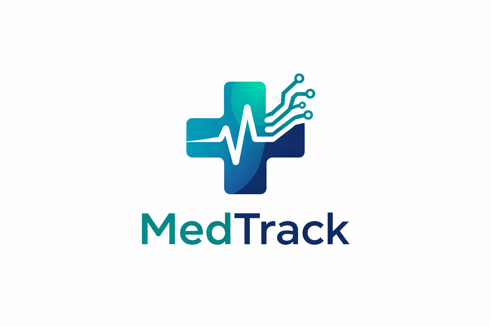

<p align="center">
  
</p>

<h1 align="center">MedTrack Health AI</h1>

<p align="center">
  Seu copiloto inteligente de saúde — centralize, interprete e consulte seus exames médicos e odontológicos com IA.
</p>

<p align="center">
  
  
  
  
  
  
</p>

---

## 📌 Sobre o projeto

O **MedTrack Health AI** resolve um problema muito comum: pessoas possuem exames espalhados em PDFs, fotos e sistemas diferentes, sem uma forma simples de acompanhar sua evolução clínica.

A aplicação atua como um **Health Intelligence Assistant** — transforma documentos médicos e odontológicos desorganizados em dados estruturados e consultáveis, permitindo que o usuário acompanhe sua saúde ao longo do tempo e faça perguntas sobre seus próprios exames em linguagem natural.

---

## ✨ Funcionalidades

### 🏠 Saúde Geral

| Funcionalidade | Descrição |
|---|---|
| **Dashboard personalizado** | Score de saúde 0–100, alertas ativos, último exame, gráfico de evolução e recomendações da IA |
| **Autenticação** | Cadastro, login com bcrypt e OAuth via Google |
| **Upload de exames** | PDF e imagens com confirmação de metadados extraídos pela IA (nome, data, médico, hospital) |
| **OCR automático** | Extração de texto de PDFs e imagens escaneadas via PyMuPDF e Tesseract (PT-BR) |
| **Resumo por IA** | Interpretação automática em linguagem acessível ao paciente |
| **Valores estruturados** | Extração de parâmetros laboratoriais com status normal/alto/baixo |
| **Evolução temporal** | Gráficos de tendência por parâmetro ao longo do tempo |
| **Alertas clínicos** | Notificações automáticas para valores fora da referência com badge no menu |
| **Timeline de saúde** | Histórico cronológico de exames com filtro por categoria |
| **Chat inteligente** | Perguntas respondidas com base nos exames, perfil e histórico odontológico via RAG |
| **Perfil de saúde** | Dados pessoais, condições, medicamentos e hábitos que personalizam as respostas da IA |

### 🦷 Saúde Bucal

| Funcionalidade | Descrição |
|---|---|
| **Odontograma interativo** | Mapa dental visual com numeração FDI, cores por status e clique para detalhes |
| **Radiografias e laudos** | Upload e análise automática de radiografias panorâmicas, periapicais e bite-wing |
| **Plano de tratamento** | Registro e acompanhamento de tratamentos planejados e realizados |
| **Extração odontológica** | IA identifica dentes afetados, status e observações clínicas do laudo |

### 🔒 Segurança e Privacidade

| Funcionalidade | Descrição |
|---|---|
| **Conformidade LGPD** | Termo de consentimento obrigatório, política de privacidade e logs de acesso |
| **Direito ao esquecimento** | Exclusão completa e permanente de todos os dados do usuário |
| **Logs de auditoria** | Registro de todas as ações para transparência e segurança |

---

## 🏗️ Arquitetura

```
medtrack-health-ai/
│
├── app.py                         # Entrypoint — roteamento e sidebar
├── theme.py                       # CSS customizado e identidade visual
├── logo-medtrack.png              # Logo do sistema
├── packages.txt                   # Dependências do sistema (Tesseract)
│
├── auth/
│   ├── auth_service.py            # Login, registro e OAuth Google
│   ├── login_ui.py                # Interface de autenticação
│   ├── register_ui.py             # Interface de cadastro
│   └── google_auth_service.py     # Fluxo OAuth 2.0 com Google
│
├── database/
│   └── db.py                      # Conexão PostgreSQL com RealDictCursor
│
├── models/
│   └── exame.py                   # Entidade Exame
│
├── repositories/
│   ├── usuario_repository.py      # CRUD de usuários + OAuth
│   ├── exame_repository.py        # CRUD de exames com metadados completos
│   ├── valores_repository.py      # Valores laboratoriais estruturados
│   ├── alertas_repository.py      # Alertas clínicos
│   ├── perfil_repository.py       # Perfil de saúde + contexto para IA
│   ├── odonto_repository.py       # Registros odontológicos e odontograma FDI
│   └── lgpd_repository.py         # Consentimentos, logs e exclusão de dados
│
├── services/
│   ├── ai_service.py              # Integração com Groq LLM
│   ├── chat_service.py            # Chat com contexto médico + odonto + perfil
│   ├── dashboard_service.py       # Score de saúde e recomendações personalizadas
│   ├── document_reader.py         # Extração de texto (OCR dispatcher)
│   ├── exame_classifier.py        # Classificação automática de categorias
│   ├── exame_service.py           # Pipeline completo de processamento
│   ├── extracao_service.py        # Extração estruturada de valores e metadados
│   ├── embedding_service.py       # Geração de embeddings semânticos
│   ├── odonto_service.py          # Análise de documentos odontológicos
│   ├── ocr_service.py             # OCR com detecção automática de SO
│   └── storage_service.py         # Upload para Supabase Storage
│
├── rag/
│   └── vector_store.py            # Busca semântica via pgvector
│
└── ui/
    ├── dashboard_ui.py            # Dashboard personalizado com score e métricas
    ├── upload_ui.py               # Upload com confirmação de metadados pela IA
    ├── timeline_ui.py             # Timeline com filtro por categoria
    ├── chat_ui.py                 # Chat com histórico multi-turno
    ├── valores_ui.py              # Tabela e gráfico de evolução de parâmetros
    ├── alertas_ui.py              # Painel de alertas clínicos
    ├── perfil_ui.py               # Modal de perfil de saúde completo
    ├── odonto_ui.py               # Odontograma interativo + documentos
    └── lgpd_ui.py                 # Termo de consentimento e painel de privacidade
```

---

## 🔄 Pipeline de processamento

```
Upload do arquivo
       ↓
IA extrai metadados automaticamente (nome, data, médico, hospital)
       ↓
Usuário confirma ou corrige os metadados
       ↓
Extração de texto via OCR (PDF ou imagem)
       ↓
Resumo interpretado pela IA em linguagem acessível
       ↓
Classificação automática da categoria
       ↓
Upload para Supabase Storage (persistência em cloud)
       ↓
Salvamento dos metadados no PostgreSQL
       ↓
Extração de valores laboratoriais estruturados
       ↓
Geração automática de alertas clínicos
       ↓
Indexação do embedding no pgvector
       ↓
Dashboard, timeline e chat atualizados em tempo real
```

---

## 🛠️ Stack tecnológica

### Backend e aplicação
- **Python 3.11**
- **Streamlit** — interface web com CSS completamente customizado

### Banco de dados
- **PostgreSQL** via **Supabase** — dados relacionais com SSL
- **pgvector** — busca semântica vetorial para RAG
- **Supabase Storage** — armazenamento de arquivos médicos em cloud

### Inteligência Artificial
- **Groq API** (`llama-3.3-70b-versatile`) — resumos, extração estruturada e chat
- **Sentence Transformers** (`all-MiniLM-L6-v2`) — embeddings semânticos

### Processamento de documentos
- **PyMuPDF** — leitura e extração de texto de PDFs
- **pytesseract + Tesseract OCR** — OCR de imagens com suporte PT-BR

### Segurança
- **bcrypt** — hash seguro de senhas
- **Authlib** — OAuth 2.0 com Google
- **Streamlit Secrets** — gestão segura de credenciais

---

## 🚀 Como rodar localmente

### Pré-requisitos

- Python 3.11+
- [Tesseract OCR](https://github.com/tesseract-ocr/tesseract) instalado localmente
- Conta no [Supabase](https://supabase.com)
- Chave de API no [Groq](https://console.groq.com)
- Projeto OAuth no [Google Cloud Console](https://console.cloud.google.com) *(opcional)*

### Instalação

```bash
# Clone o repositório
git clone https://github.com/Guilhermepe1/medtrack-health-ai.git
cd medtrack-health-ai

# Crie e ative o ambiente virtual
python -m venv venv
source venv/bin/activate   # Linux/Mac
venv\Scripts\activate      # Windows

# Instale as dependências Python
pip install -r requirements.txt
```

### Configuração

Crie o arquivo `.streamlit/secrets.toml` na raiz do projeto:

```toml
DB_HOST              = "seu-host.supabase.com"
DB_USER              = "postgres.seu-projeto"
DB_PASSWORD          = "sua-senha-supabase"
SUPABASE_URL         = "https://seu-projeto.supabase.co"
SUPABASE_SERVICE_KEY = "sua-service-role-key"
GROQ_API_KEY         = "sua-chave-groq"

# OAuth Google (opcional)
GOOGLE_CLIENT_ID     = "seu-client-id.apps.googleusercontent.com"
GOOGLE_CLIENT_SECRET = "seu-client-secret"
GOOGLE_REDIRECT_URI  = "http://localhost:8501"
```

> ⚠️ Nunca suba o `secrets.toml` para o GitHub. Confirme que ele está no `.gitignore`.

### Banco de dados

Execute todos os scripts SQL no **Supabase SQL Editor**:

```sql
-- Extensão vetorial
CREATE EXTENSION IF NOT EXISTS vector;

-- Usuários
CREATE TABLE usuarios (
    id SERIAL PRIMARY KEY,
    nome VARCHAR(100) NOT NULL,
    username VARCHAR(50) UNIQUE NOT NULL,
    senha TEXT,
    email VARCHAR(255),
    google_id VARCHAR(100),
    avatar_url TEXT
);

-- Exames
CREATE TABLE exames (
    id SERIAL PRIMARY KEY,
    usuario_id INTEGER REFERENCES usuarios(id) ON DELETE CASCADE,
    arquivo VARCHAR(255),
    texto TEXT,
    resumo TEXT,
    categoria VARCHAR(100),
    storage_path TEXT,
    nome_exame VARCHAR(255),
    data_exame DATE,
    medico VARCHAR(255),
    hospital VARCHAR(255),
    data_upload TIMESTAMP DEFAULT NOW()
);

-- Embeddings vetoriais (RAG)
CREATE TABLE exame_embeddings (
    id SERIAL PRIMARY KEY,
    exame_id INTEGER REFERENCES exames(id) ON DELETE CASCADE,
    usuario_id INTEGER REFERENCES usuarios(id) ON DELETE CASCADE,
    embedding vector(384)
);
CREATE INDEX ON exame_embeddings USING ivfflat (embedding vector_l2_ops);

-- Valores laboratoriais estruturados
CREATE TABLE exame_valores (
    id SERIAL PRIMARY KEY,
    exame_id INTEGER REFERENCES exames(id) ON DELETE CASCADE,
    usuario_id INTEGER REFERENCES usuarios(id) ON DELETE CASCADE,
    parametro VARCHAR(100),
    valor NUMERIC,
    unidade VARCHAR(50),
    referencia_min NUMERIC,
    referencia_max NUMERIC,
    status VARCHAR(20),
    data_coleta DATE,
    created_at TIMESTAMP DEFAULT NOW()
);
CREATE INDEX ON exame_valores (usuario_id, parametro, data_coleta);

-- Alertas clínicos
CREATE TABLE alertas_clinicos (
    id SERIAL PRIMARY KEY,
    usuario_id INTEGER REFERENCES usuarios(id) ON DELETE CASCADE,
    exame_id INTEGER REFERENCES exames(id) ON DELETE CASCADE,
    parametro VARCHAR(100),
    valor NUMERIC,
    unidade VARCHAR(50),
    referencia_min NUMERIC,
    referencia_max NUMERIC,
    status VARCHAR(20),
    lido BOOLEAN DEFAULT FALSE,
    created_at TIMESTAMP DEFAULT NOW()
);
CREATE INDEX ON alertas_clinicos (usuario_id, lido);

-- Perfil de saúde
CREATE TABLE perfil_saude (
    id SERIAL PRIMARY KEY,
    usuario_id INTEGER UNIQUE NOT NULL REFERENCES usuarios(id) ON DELETE CASCADE,
    data_nascimento DATE,
    sexo VARCHAR(20),
    peso NUMERIC(5,2),
    altura INTEGER,
    condicoes TEXT[],
    outras_condicoes TEXT,
    medicamentos TEXT,
    fumante VARCHAR(20),
    consumo_alcool VARCHAR(20),
    atividade_fisica VARCHAR(20),
    updated_at TIMESTAMP DEFAULT NOW()
);

-- Odontologia
CREATE TABLE registros_odonto (
    id SERIAL PRIMARY KEY,
    usuario_id INTEGER NOT NULL REFERENCES usuarios(id) ON DELETE CASCADE,
    tipo VARCHAR(50) NOT NULL,
    subtipo VARCHAR(50),
    nome_arquivo VARCHAR(255),
    storage_path TEXT,
    texto_extraido TEXT,
    resumo TEXT,
    dentista VARCHAR(255),
    clinica VARCHAR(255),
    data_registro DATE,
    created_at TIMESTAMP DEFAULT NOW()
);

CREATE TABLE odontograma (
    id SERIAL PRIMARY KEY,
    usuario_id INTEGER NOT NULL REFERENCES usuarios(id) ON DELETE CASCADE,
    numero_dente INTEGER NOT NULL,
    status VARCHAR(50),
    observacao TEXT,
    updated_at TIMESTAMP DEFAULT NOW(),
    UNIQUE (usuario_id, numero_dente)
);

-- LGPD
CREATE TABLE consentimentos (
    id SERIAL PRIMARY KEY,
    usuario_id INTEGER NOT NULL REFERENCES usuarios(id) ON DELETE CASCADE,
    versao VARCHAR(20) NOT NULL,
    aceito BOOLEAN NOT NULL DEFAULT FALSE,
    ip VARCHAR(50),
    user_agent TEXT,
    created_at TIMESTAMP DEFAULT NOW()
);

CREATE TABLE logs_acesso (
    id SERIAL PRIMARY KEY,
    usuario_id INTEGER NOT NULL REFERENCES usuarios(id) ON DELETE CASCADE,
    acao VARCHAR(100) NOT NULL,
    descricao TEXT,
    ip VARCHAR(50),
    created_at TIMESTAMP DEFAULT NOW()
);
CREATE INDEX ON logs_acesso (usuario_id, created_at DESC);
```

### Executar

```bash
streamlit run app.py
```

Acesse em `http://localhost:8501`

---

## ☁️ Deploy

A aplicação está publicada no **Streamlit Community Cloud** com deploy automático a cada push.

```
git push → GitHub → Deploy automático → Streamlit Cloud
```

Para configurar seu próprio deploy:

1. Faça fork do repositório
2. Acesse [share.streamlit.io](https://share.streamlit.io)
3. Conecte o repositório
4. Configure todos os Secrets no painel do Streamlit Cloud
5. Deploy!

> O arquivo `packages.txt` na raiz garante a instalação automática do Tesseract OCR no servidor Linux do Streamlit Cloud.

---

## 🗺️ Roadmap

### ✅ Concluído

- [x] Dashboard de saúde personalizado com score 0–100
- [x] Autenticação com bcrypt + OAuth Google
- [x] Upload de PDFs e imagens com OCR (PT-BR)
- [x] Extração automática de metadados (nome, data, médico, hospital)
- [x] Confirmação e correção de metadados pelo usuário
- [x] Resumo automático por IA
- [x] Timeline de exames com filtros por categoria
- [x] Chat inteligente com RAG (pgvector) e histórico multi-turno
- [x] Extração estruturada de valores laboratoriais
- [x] Alertas clínicos automáticos com badge no menu
- [x] Gráficos de evolução temporal por parâmetro
- [x] Supabase Storage para arquivos em cloud
- [x] Perfil de saúde completo (dados, condições, medicamentos, hábitos)
- [x] Saúde bucal com odontograma interativo (numeração FDI)
- [x] Upload e análise automática de laudos e radiografias
- [x] Conformidade LGPD (consentimento, logs, direito ao esquecimento)
- [x] Tema visual customizado com identidade da marca MedTrack

### 🔜 Próximos passos

- [ ] Comparação inteligente entre exames pela IA
- [ ] Insights proativos sobre tendências de saúde
- [ ] Exportar relatório completo em PDF
- [ ] Compartilhamento seguro de exames com médico (link temporário)
- [ ] Suporte a mais tipos de exame (lipidograma, tireoide, vitaminas)
- [ ] Autenticação 2FA
- [ ] Multi-paciente (gerenciar saúde de dependentes)
- [ ] Planos e assinatura (Free / Pro)
- [ ] API pública para integração com clínicas

---

## ⚠️ Aviso importante

O MedTrack Health AI é uma ferramenta de **apoio informacional** e **não substitui consulta médica ou odontológica**. As interpretações geradas pela IA têm caráter educativo. Sempre consulte um profissional de saúde habilitado para diagnósticos e decisões clínicas.

---

## 📄 Licença

Este projeto está sob a licença MIT. Veja o arquivo [LICENSE](LICENSE) para mais detalhes.

---

<p align="center">
  
  <br/>
  <sub>Desenvolvido com ❤️ e IA</sub>
</p>
